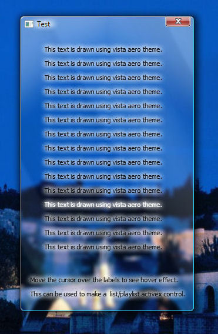



## Use of DWM and uxTheme API for WIndows Vista with aero support\.

### Description

this code demonstrates how to make label controls which display text in aero theme style using DWM and uxTheme API.

Tags : drawthemetextex , logfont , dwm , aero , vista , extendframeintoclientarea , subclas
 
### More Info
 
if u need any explanations, ask me by email.

if anyone can suggest me ways to improve it pls tell me by email..

I will be gratefull if u rate the code....

removing the window frame by uncommenting a certain part of commented code lines in this code may cause a BSOD ( bluescreen ) by causing a display driver failure....but u can reboot and it will be set alright. this probably due to some memory overflow.

will soon figure it out....

rest is all gud.

             |
---                |---
**Submitted On**   |2007-09-20 12:08:42
**By**             |[Soumik Chatterjee](https://github.com/Planet-Source-Code/PSCIndex/blob/master/ByAuthor/soumik-chatterjee.md)
**Level**          |Advanced
**User Rating**    |5.0 (30 globes from 6 users)
**Compatibility**  |VB 6\.0
**Category**       |[Windows API Call/ Explanation](https://github.com/Planet-Source-Code/PSCIndex/blob/master/ByCategory/windows-api-call-explanation__1-39.md)
**World**          |[Visual Basic](https://github.com/Planet-Source-Code/PSCIndex/blob/master/ByWorld/visual-basic.md)
**Archive File**   |[Use\_of\_DWM2084049202007\.zip](https://github.com/Planet-Source-Code/soumik-chatterjee-use-of-dwm-and-uxtheme-api-for-windows-vista-with-aero-support__1-69366/archive/master.zip)

